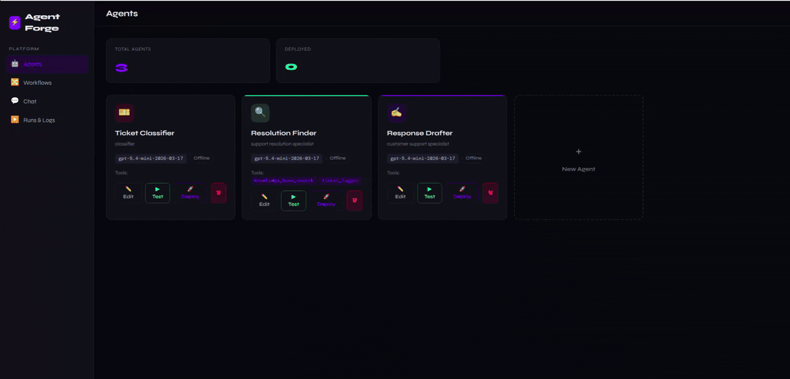
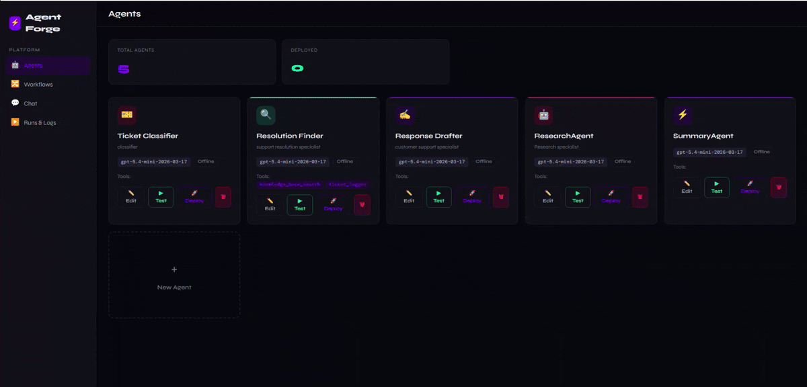

# Agent-forge


A production-ready multi-agent AI platform: create agents, wire them into collaborative workflows with a visual builder, orchestrate multi-agent business logic with Playbooks, and deploy over Telegram. Built on LangGraph, FastAPI, Next.js, and PostgreSQL.

---

## Demo


### Agent Studio
<!-- demo-agent-studio -->


### Customer Support Triage Playbook
<!-- demo-playbook -->


### Visual Workflow Builder
<!-- demo-workflow-builder -->


---

## Features

- **Agent Studio** — Create agents with custom model, system prompt, tools, and memory. Model field accepts any name or pick from the configured list.
- **Visual Workflow Builder** — Drag-and-drop canvas (React Flow) to wire agents into graphs with conditional routing
- **Playbooks** — Define multi-agent business logic in plain language; a supervisor agent coordinates the team at runtime
- **Pre-seeded Playbook** — A ready-to-run **Customer Support Triage** playbook (3 agents) is loaded automatically on first `docker compose up`
- **Config-driven models & channels** — Edit `backend/config.py` to control which models and channel types appear in dropdowns across the UI
- **Live Monitor** — WebSocket-powered real-time log stream with token accounting
- **Telegram Integration** — Wire any agent or playbook to a Telegram bot via webhook
- **Docker-ready** — Single `docker compose up -d` launches all services

---

## Project Structure

```
agentplatform/
├── backend/
│   ├── api/
│   │   ├── routes/           # agents, workflows, runs, playbooks, chat, conversations, telegram, config_options
│   │   └── websockets.py     # WebSocket live log stream
│   ├── agents/
│   │   ├── builder.py        # create_react_agent wrapper
│   │   ├── tools/            # web_search, knowledge_base, dunning, subscriptions, etc.
│   │   ├── memory.py
│   │   └── guardrails.py
│   ├── runtime/
│   │   ├── coordinator.py    # core execution engine
│   │   ├── workflow_builder.py
│   │   ├── playbook_runner.py
│   │   ├── seeder.py         # seeds built-in tools + Customer Support Triage playbook on startup
│   │   └── event_stream.py   # Redis Pub/Sub publisher
│   ├── messaging/
│   │   └── telegram.py       # webhook handler + reply
│   ├── models/               # SQLAlchemy ORM (Agent, Workflow, Playbook, Run, Message, Conversation)
│   ├── config.py             # settings + AVAILABLE_MODELS + AVAILABLE_CHANNELS
│   └── tests/
├── frontend/
│   ├── app/
│   │   ├── agents/           # Agent CRUD
│   │   ├── workflows/        # Visual workflow builder
│   │   └── monitor/          # Live logs + message history
│   ├── components/
│   │   ├── ModelCombobox.tsx # free-text model input with config-driven suggestions
│   │   ├── workflow/         # WorkflowCanvas, AgentNode, ConditionEdge, NodePalette
│   │   └── monitor/          # LogStream, MessageTimeline
│   └── lib/                  # Typed API client, WebSocket hook
├── docker-compose.yml
└── .env.example
```

---

## Quick Start

### 1. Clone and configure

```bash
git clone https://github.com/Aaronreb/agent-forge.git agentplatform
cd agentplatform
cp .env.example .env
# Edit .env — add OPENAI_API_KEY or ANTHROPIC_API_KEY
```

### 2. Start all services

```bash
docker compose up -d
```

Services: `postgres` (5432), `redis` (6379), `backend` (8000), `frontend` (3000).

The backend automatically creates and migrates all database tables on first startup, then seeds the **Customer Support Triage** playbook and all built-in tools.

### 3. Open the UI

Navigate to **http://localhost:3000**

A **Customer Support Triage** playbook with 3 agents is pre-loaded and ready to run — no setup needed.

### 4. Connect Telegram (optional)

```bash
# Expose local backend with ngrok
ngrok http 8000

# Register the webhook with Telegram
curl "https://api.telegram.org/bot$TELEGRAM_BOT_TOKEN/setWebhook?url=https://<ngrok-id>.ngrok.io/telegram/webhook"
```

Create a Channel of type `telegram` in the UI, attach it to an agent or playbook, and messages sent to your bot will trigger it.

---

## Configuring Models & Channels

Edit `backend/config.py` to control what appears in the UI dropdowns:

```python
AVAILABLE_MODELS = [
    "gpt-5.4-mini-2026-03-17",
    "gpt-4o",
    "gpt-4o-mini",
    "claude-sonnet-4-6",
    # add any model name here
]

AVAILABLE_CHANNELS = ["telegram", "slack", "whatsapp"]
```

The model field in the UI also accepts free text — type any model name not in the list and it will be used as-is.

---

## Pre-Seeded Playbook

On first startup, the platform automatically creates a **Customer Support Triage** playbook with three agents:

| Agent | Role | Tools |
|---|---|---|
| 🎫 **Ticket Classifier** | Classifies the ticket — outputs category, priority, sentiment, and summary as JSON | none |
| 🔍 **Resolution Finder** | Searches the KB twice + logs the ticket to the tracker | `knowledge_base_search`, `ticket_logger` |
| ✍️ **Response Drafter** | Writes an empathetic, ready-to-send customer reply | none |

**Flow:** Ticket → Classifier (JSON) → Resolution Finder (KB search + log) → Response Drafter → final reply prefixed with `Priority | Category | Sentiment`.

To test: open **Playbooks** → **Customer Support Triage** → **Run** → type a support query such as *"I was charged twice this month and need a refund"*.

---

## End-to-End Demo

### Playbook Demo (pre-seeded)

1. Open **http://localhost:3000** → **Playbooks**
2. Select **Customer Support Triage** — it's already deployed and ready
3. Click **Run**, type: *"I was charged twice this month and need a refund"*
4. Watch the 3-step pipeline: Ticket Classifier outputs JSON → Resolution Finder searches KB and logs the ticket → Response Drafter writes the customer reply
5. Final output includes a `Priority | Category | Sentiment` header followed by the ready-to-send response
6. Open **Monitor** to see the full message trace with token counts

### Visual Workflow Demo

1. **Agents** → create two agents:
   - **ResearchAgent** — model `gpt-5.4-mini-2026-03-17`, no tools, prompt: *"You are a research assistant. Gather and organise detailed, accurate information on the given topic."*
   - **SummaryAgent** — model `gpt-5.4-mini-2026-03-17`, no tools, prompt: *"You are a summarization expert. Produce a clear, concise report from the research provided."*
2. **Workflows** → **New Workflow** → drag both agents onto the canvas and connect them
3. **Monitor** → select the workflow → type *"Explain how LangGraph works"* → click **Launch**
4. Watch the live event stream: ResearchAgent drafts the research, then hands off to SummaryAgent which produces the final report

### Telegram Demo

1. Set `TELEGRAM_BOT_TOKEN` in `.env` and restart
2. Expose the backend: `ngrok http 8000`
3. Register the webhook:
   ```bash
   curl "https://api.telegram.org/bot$TELEGRAM_BOT_TOKEN/setWebhook?url=https://<ngrok-id>.ngrok.io/telegram/webhook"
   ```
4. In the UI, go to your agent or playbook → **Channels** → add a Telegram channel
5. Send a message to your Telegram bot — the agent replies directly in chat

---

## How to Add a New Messaging Channel

1. Create `backend/messaging/my_channel.py` with:
   - `async def send(chat_id, text)` — sends a reply
   - A webhook handler function
2. Register a FastAPI router in `api/main.py` at `/my_channel/webhook`
3. Add the channel type to `AVAILABLE_CHANNELS` in `backend/config.py`
4. Use `messaging/telegram.py` as a reference for looking up the agent and calling `execute_workflow`

---

## API Reference

| Method | Path | Description |
|---|---|---|
| GET/POST | `/agents` | List / create agents |
| GET/PUT/DELETE | `/agents/{id}` | Get / update / delete agent |
| GET | `/agents/tools/list` | Available tools |
| GET/POST | `/agents/channels` | List / create channels |
| GET/POST | `/workflows` | List / create workflows |
| GET/POST | `/playbooks` | List / create playbooks |
| POST | `/playbooks/{id}/deploy` | Activate a playbook |
| POST | `/runs` | Start a workflow run |
| GET | `/runs/{id}/messages` | Message history for a run |
| GET | `/config/options` | Available models and channel types |
| WS | `/ws/logs?run_id=X` | Live event stream |
| POST | `/telegram/webhook` | Telegram bot webhook |

---

## License

MIT © 2025 Aaron Rebello
